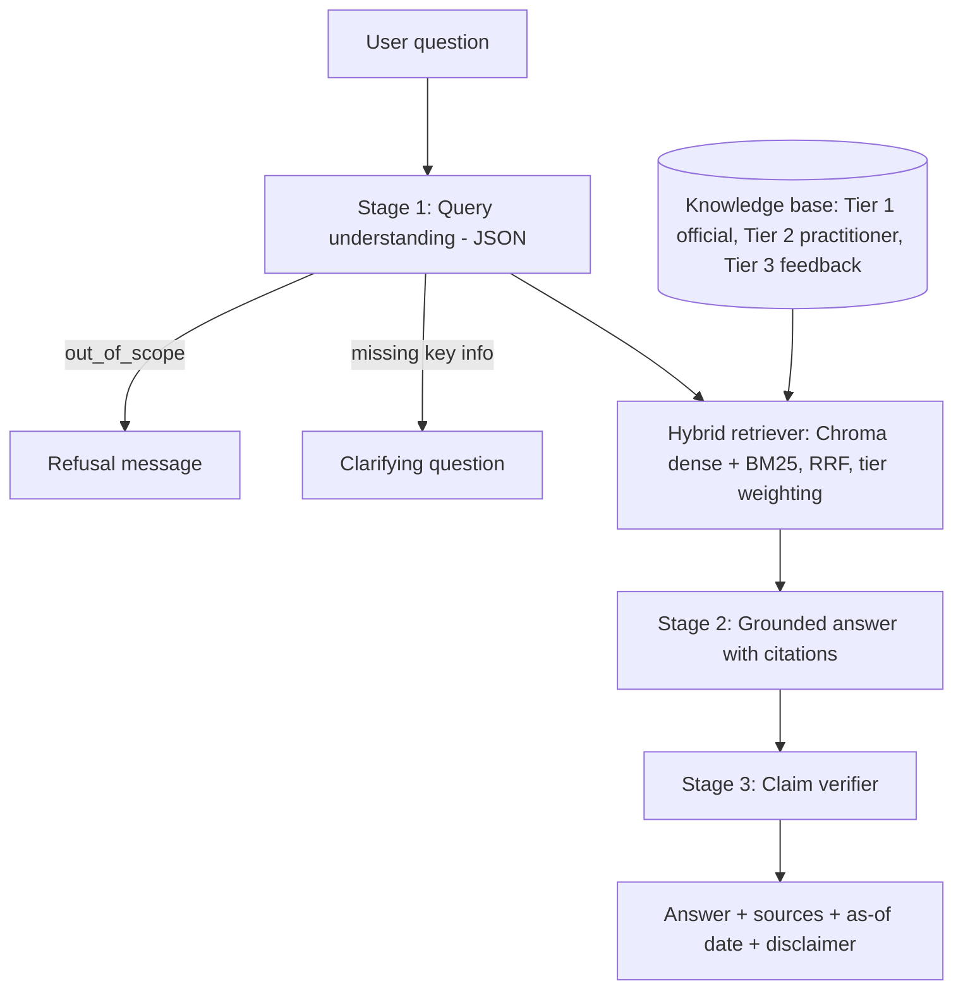

# Architecture

```mermaid
flowchart TD
    U[User question] --> QU[Stage 1: Query understanding - JSON]
    QU -->|out_of_scope| R[Refusal message]
    QU -->|missing key info| C[Clarifying question]
    QU --> RET[Hybrid retriever: Chroma dense + BM25, RRF, tier weighting]
    KB[(Knowledge base: Tier 1 official, Tier 2 practitioner, Tier 3 feedback)] --> RET
    RET --> ANS[Stage 2: Grounded answer with citations]
    ANS --> VER[Stage 3: Claim verifier]
    VER --> OUT[Answer + sources + as-of date + disclaimer]
```

Ingestion: sources.yaml / data/raw / feedback.csv -> clean -> chunk (350 words, 60 overlap) -> embed (bge-small) -> Chroma + chunks.jsonl (BM25).
